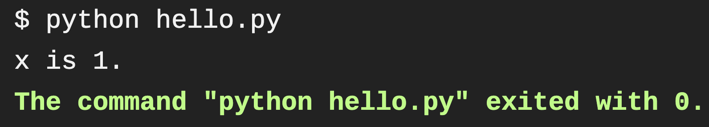

# IBM easy multi arch build

Multi arch show off using IBM archs for Travis CI.

This `.travis.yml` file tests my quick Python app I made entitled `hello.py` that looks like this: 

```python
x = 1
if x == 1:
    # indented four spaces
    print("x is 1.")
    
# Used Python 3.7 for different testing on the IBM multi arch builds
# Author Montana Mendy
```

In all three `archs`: 

```bash
arch: amd64
arch: ppc64le
arch: s390x
```

It built `hello.py` very quickly, and was extremely straight forward. 

### End Result 

It built my Python script with the correct answer which is `x=1`:

 

All three `archs` built, and ran my `hello.py` script:


